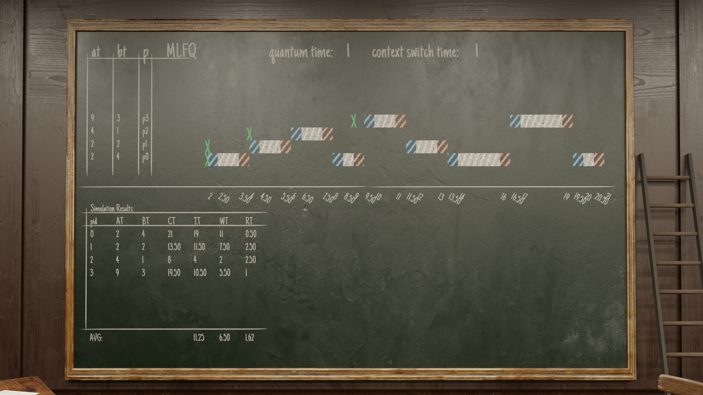
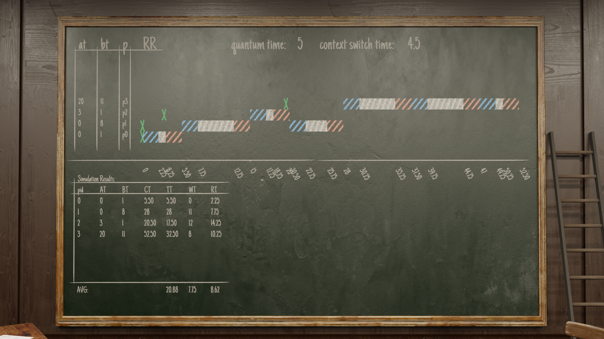

# 3D CPU Scheduling Simulator (Blender Visualization)

A high-fidelity CPU process scheduling simulator that utilizes the **Blender Python API (bpy)** to generate detailed, 3D visualizations of Gantt charts and metric tables.

Unlike standard command-line simulators, this project visualizes the exact "heartbeat" of the CPU, showing how different scheduling algorithms handle process execution, context switching, idle time, and queue management in a 3D environment.


*Figure 1: Generated Metrics Table and 3D Gantt Chart*


*Figure 2: Generated Metrics Table and 3D Gantt Chart*


## Core Architecture: Event-Driven Simulation

This scheduler is **Event-Based**, not just a simple loop. It is designed to simulate realistic OS kernel behavior:

### 1. Event Detection & Preemption
The simulation runs on a precise "Tick" system, but decisions are driven by events.
*   **Arrival Monitoring:** Whenever a new process arrives (`PROCESS_ARRIVAL`), the system flags that a **New Event Occurred**.
*   **Immediate Re-evaluation:** Even if a process is currently running (`EXECUTING`), the scheduler immediately checks the **Ready Queue** (across all Multi-Level queues) to see if the new arrival is a "better" process based on the current algorithm's rules.
*   **Context Switching:** If a higher-priority process (or shorter job in SRTF) arrives, the current process is preempted. The system transitions through `CS_SAVE` (saving old process) $\rightarrow$ `CS_LOAD` (loading new process) states, accounting for overhead time.

### 2. Multi-Level Queue Management
For algorithms like **MLQ** and **MLFQ**:
*   The system manages multiple `QueueLevel` objects, each with its own logic (e.g., Round Robin for interactive, FCFS for batch).
*   The scheduler continually scans these levels from top (highest priority) to bottom. If a process arrives in Queue 0 while the CPU is working on Queue 2, the lower-priority process is immediately interrupted.


## Features

*   **3D Visualization:** Draws the Gantt chart, axes, and data tables directly into a 3D "Blackboard" scene.
*   **Precise Timing:** Automatically handles floating-point inputs (e.g., 0.4ms) by scaling them to integer "ticks" to prevent floating-point errors during simulation.
*   **State Logging:** Tracks every state change: `NEW`, `READY`, `RUNNING` (Executing), `CS_LOAD`, `CS_SAVE`, `WAITING`, and `TERMINATED`.
*   **Metrics Calculation:** Automatically computes and displays:
    *   Turnaround Time (TAT)
    *   Waiting Time (WT)
    *   Response Time (RT)
    *   Completion Time (CT)


## Supported Algorithms

The `Scheduler` class supports both Preemptive and Non-Preemptive algorithms:

1.  **FCFS** (First-Come, First-Served) - *Non-preemptive*
2.  **SPN** (Shortest Process Next / SJF) - *Non-preemptive*
3.  **HRRN** (Highest Response Ratio Next) - *Non-preemptive*
4.  **SRTF** (Shortest Remaining Time First) - *Preemptive*
5.  **RR** (Round Robin) - *Preemptive (Time Quantum)*
6.  **MLQ** (Multi-Level Queue) - *Fixed Priority with multiple queues*
7.  **MLFQ** (Multi-Level Feedback Queue) - *Dynamic Priority Feedback*


## Project Structure

*   **`BlenderFile/Main Scene.blend`**: The main project file. Open this in Blender. It contains the 3D environment (Camera, Lights, Blackboard object). All necessary python files are already loaded.
*   **`main.py`**: The entry point. Contains the `Scheduler` logic, algorithm implementations, and input configuration. **(Run this file)**.
*   **`definitions.py`**: Shared data structures (`Process`, `SimulationLog`), Enums, and helper functions for input validation and time scaling.
*   **`BlenderCode.py`**: The interface between the Python logic and Blender. Handles 3D object creation, material assignment, and text generation.


## How to Run

### Prerequisites
*   **Blender 3.x or 4.x** installed.
*   No external Python installation is required (Blender has its own).

### Execution Steps
1.  Open `BlenderFile/Main Scene.blend`.
2.  Go to the **Scripting** tab (top menu).
3.  Ensure `main.py` is open in the text editor.
4.  **Configuration:** Scroll to the bottom of `main.py` to set your processes and algorithm (see below).
5.  **Run:** Press the **Play Icon** (▶) in the text editor header.

### Workflow: Reset vs. Render
To avoid certain issues that will be addressed in future updates, use the designated lines in `main.py` (around line 1440) to toggle between clearing the scene and drawing the new chart.
```python
# Option A: CLEAR the Scene (Run this first)
BlenderCode.blackboard_reset()
# BlenderCode.generate_gantt_and_metrics_table_blender(...)

# Option B: DRAW the Scene (Run this second)
# BlenderCode.blackboard_reset()
BlenderCode.generate_gantt_and_metrics_table_blender(self.logs, ...)
```


## Configuration Example

Located at the bottom of `main.py`:

```python
# [Arrival Time, Burst Time]
input_list: InputList = [
[0, 6], 
[2, 4], 
[4, 8], 
[6, 2]
]

# For MLQ, use format: [AT, BT, "CATEGORY"]
# Categories: "REAL_TIME", "SYSTEM", "INTERACTIVE", "BATCH"

input_quantum_time: float = 2   # Time Slice for Round Robin
input_cs_time: float = 0.4      # Context Switch Overhead
input_algorithm: STSAlgo = "SRTF" # Choose Algorithm

# Run the scheduler
scheduler = Scheduler(...)
scheduler.run(input_algorithm)
```
